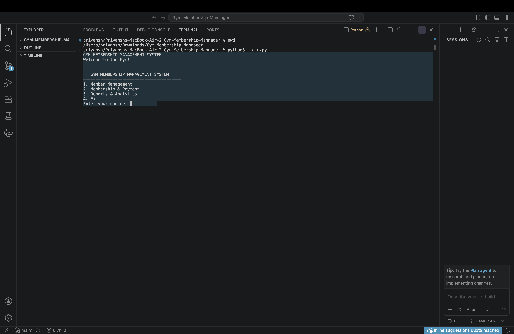
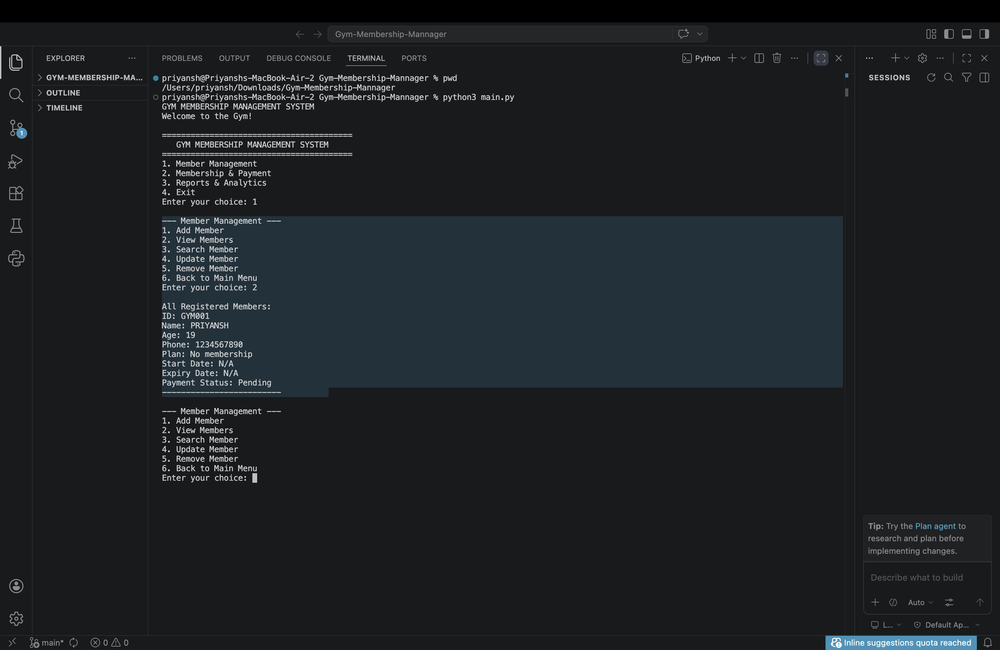
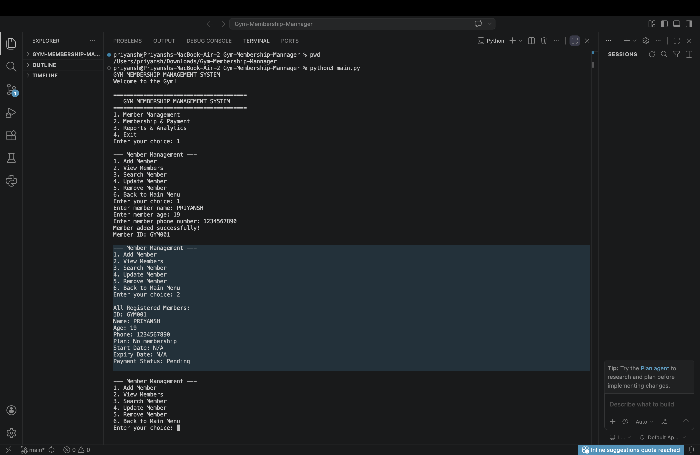
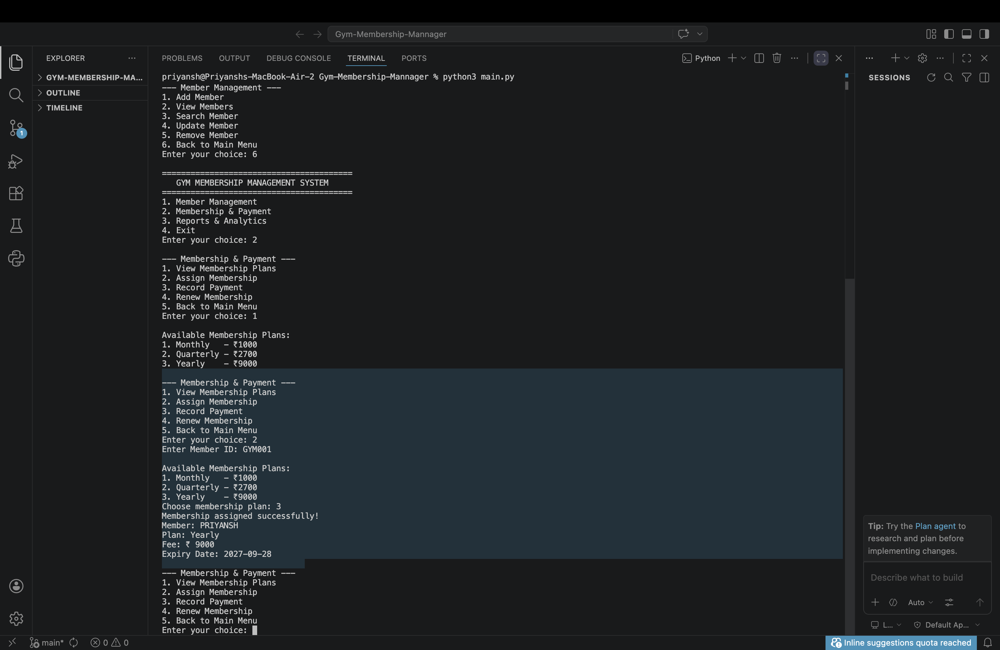
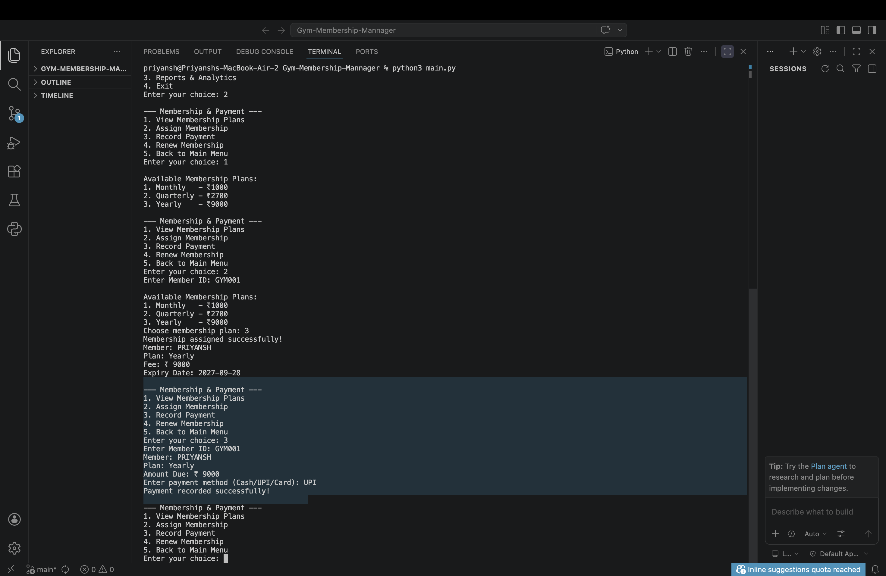
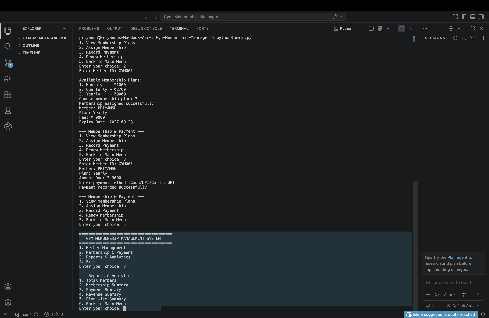
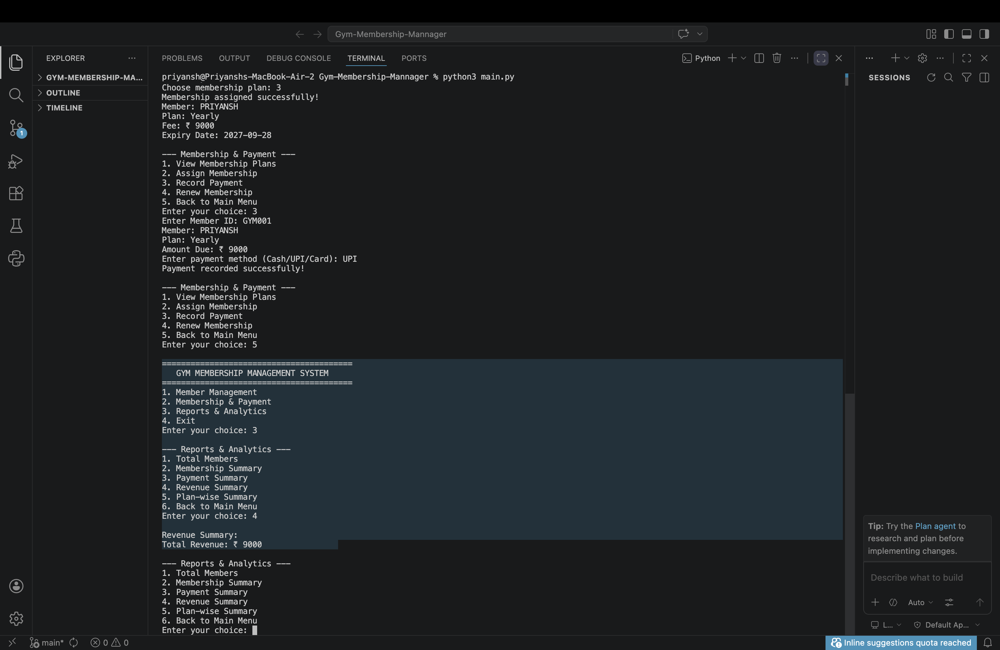

# Gym Membership Management System

## Overview
A command-line Python application for managing gym members, membership plans, payments, renewals, and reports.

## Features
- Add, view, search, update, and remove members
- Automatic member IDs
- Input validation
- Monthly, Quarterly, and Yearly membership plans
- Membership start and expiry dates
- Cash, UPI, and Card payment methods
- Paid/Pending payment status
- Revenue and plan-wise reports
- JSON data storage

## Technologies
Python 3, JSON, Command Line Interface, Git/GitHub

## Run
```bash
python3 main.py
```

## Test
```bash
python3 tests/test_gym.py
```

## Project Structure
`main.py` - main flow  
`members.py` - member management  
`memberships.py` - membership and payment  
`reports.py` - analytics  
`storage.py` - JSON storage  
`validators.py` - validation  
`payments.py` - payment module  
`members.json` - stored data  
`tests/` - tests


## Screenshots

### Main Menu


### Member Added


### Member Details


### Membership Assigned


### Payment Recorded


### Reports & Analytics


### Revenue Summary


